<!-- keep this here -->

<!--

    
<h3>Contact Information</h3>

-->

    
 <a href = "mailto: drossetti12@gmail.com">drossetti12@gmail.com</a> | <a href = "https://www.linkedin.com/in/daniel-r-10882139/">LinkedIn</a> | <a href = "https://www.credential.net/0655323a-4a50-49d6-9dfc-a81e5e4b7ca8#gs.o5fack">MIT ADSP Certificate</a> | <a href = "https://eportfolio.greatlearning.in/daniel-rossetti">MIT ADSP ePortfolio</a>

---

    
<h1>About Me</h1>

Hello!  I'm a mechanical engineer with over 11 years of experience aspiring to become a data scientist.  Just last year, I completed the MIT Applied Data Science Program (MIT ADSP) and have since decided to pursue this field for my next career move.  Below are the projects from my course and the first of what I hope will be many more self-directed projects in areas of specific interest.  More to come soon! 

---

    
<h1>Project Portfolio Contents</h1>

<b><i>Note:  Links to project repositories and code coming soon! - (starting week of February 14, 2022)</i></b>
 

- Forecasting Carbon Emissions - Capstone Project
- Recommending Amazon Products
- Titanic Survival Model
- House Number Image Recognition
- Predicting Boston Home Prices
- Car Clustering
- Contact Information

<!--
h1{
    margin-top: 0px;
}
-->
<!--                                *********************************** 1 - CARBON EMISSIONS ************************************************* -->
---

    
<h1>Forecasting Carbon Emissions - Capstone Project</h1>

    
<b><i>Using Timeseries Regression Techniques to Predict Greenhouse Gas Emissions</i></b>

A timeseries regression model was created to forecast future carbon emissions using timeseries data for electric energy production emissions from natural gas in the US from 1973 to 2016.

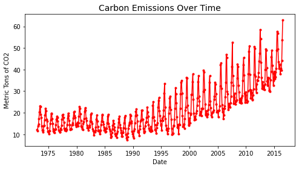
### Major Accomplishments:
- A model was created to forecast future emissions for a period of 1 year beyond the provided data
- Training Data Processing:
  - Different data transformation techniques were evaluated to optimize model performance
  - Various training data timespans were examined to reduce prediction error and determine how much of the provided training data should be used to train the model
- Model Development:
  - Basic AR, MA, ARMA, and ARIMA models were optimized and evaluated
  - A Seasonal ARIMA (SARIMA) model was tuned using the Pmdarima auto_arima optimizer function
- Model performance was primarily characterized by calculating root mean squared error (RMSE) values for each combination of model, transformation technique, and fit data timespan 

### Key Outcomes:
- A 3% mean absolute percent error (MAPE) for the final model was calculated against the validation dataset 

  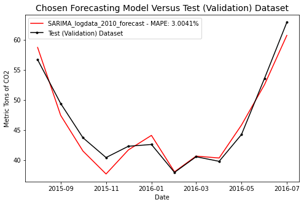 
- Carbon emissions levels were forecasted for the 12 months following the provided data 

  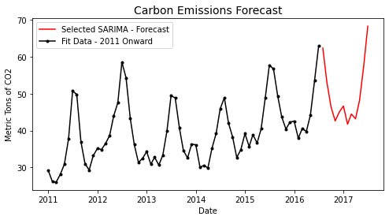

<!--                                      *********************************** 2 - TITANIC ************************************************* -->

---

    
<h1>Titanic Survival Model</h1>

    
<b><i>Implementing Classification Techniques to Predict Passenger Survival</i></b>

For the Kaggle competition, "Titanic - Machine Learning from Disaster," a classification model was developed to determine the outcome (survival or death) of passengers on the Titanic based on personal information such as the passenger gender, age, class, and other categorical and numerical variables.  Datasets were provided by Kaggle and included a training dataset with passenger outcomes model fitting and a test dataset on which to run the model and submit the results for the competition. 
### Major Accomplishments:
- Performed exploratory data analysis (EDA) on passenger data to find trends and inform feature engineering  

    

- Employed hypothesis testing to validate the statistical significance of engineered features  
  
    
- Examined the performance of Logistic Regression, K-Neighbors, Decision Tree, and Random Forest Classifier models
- Used sklearn GridSearchCV to optimize models to increase model accuracy
- Generated training and validation sets using sklearn ShuffleSplit to simulate the effects of unseen data and reduce overfitting  

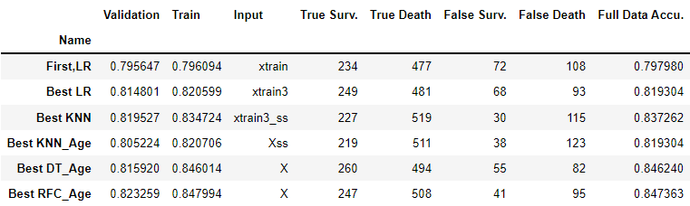 

### Key Outcomes:
- A random forest classifier model was chosen with a predicted accuracy of about 82% based on validation data
- The chosen random forest model predicted the test data with a 77.3% accuracy
  - Next steps and model refinements are proposed in the code to improve this closer to the 82% prediction accuracy achieved on the validation datasets

<!--                                *********************************** 2.5 - RECOMMENDATION SYSTEMS ************************************************* -->
---

    
<h1>Recommending Amazon Products</h1>

    
<b><i>Using Recommendation System Techniques to Make Better Recommendations</i></b>

In this relatively short project, a recommendation system was created comparing the performance of three models which were all tasked with making Amazon product recommendations.  Data from 1,540 users rating a total of 48,190 products were used to build and train the models.

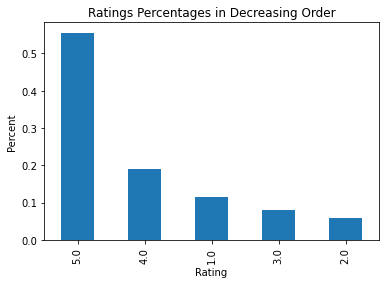
### Major Accomplishments:
- A simple rank based filtering model was used recommend a specified number of top products with over a certain number of ratings that have the highest average ratings
- A collaborative filtering model was built using cosine similarity to establish similarity between any given user and all other users.  Recommendations were then made most highly-rated products based from the most similar users
- A final collaborative filtering model employing Singular Variable Decomposition (SVD) was created using 50 latent features to predict a full matrix of all user's rating for every product 

### Key Outcomes:
- All three models were capable of making product recommendations for a given user
- A recent reexamination of the SVD model results determined that the model must be optimized if not fully overhauled in a subsequent iteration of this project to produce better recommendation results 

<!--                                      *********************************** 3 - SVHN Neural Nets ************************************************* -->
---

    
<h1>House Number Image Recognition</h1>

    
<b><i>Employing Neural Networks to Recognize Digits</i></b>

Artificial Neural Network (ANN) and Convolutional Neural Network (CNN) models were implemented to recognize numbers in a sample of 60,000 greyscale images derived from the Street View Housing Number (SVHN) dataset which contains images of numbers zero through nine.  Each neural network model was modified to improve prediction accuracy, and confusion matrices were created to assess the performance of the improved models.  A sample of the images is shown below.  The original SVHN source and citation are provided at the end of this project section.

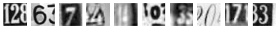

### Major Accomplishments:
- ANN and CNN models were created using TensorFlow and Keras
- A simple ANN model was initially created using dense layers with ReLU activation.  An improved model incorporated higher node counts, additional dense layers, dropout and batch normalization layers, and a higher number of epochs
- An initial CNN model was created with convolutional, pooling, and dense layers using Leaky ReLU activation.  An improved model incorporated batch normalization, dropout, and additional convolution layers, while also increasing the number of epochs

### Key Outcomes:
- Artificial and Convolutional Neural Network models were created which achieved final accuracies of 75% and 90% respectively on the test data.  The confusion matrix for the CNN model is shown below:

  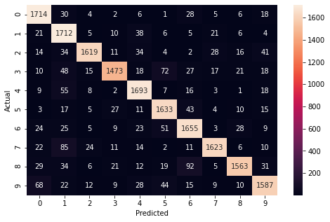

***Original Source and Citation for SVHN Images Shown:***
Original Source:
[http://ufldl.stanford.edu/housenumbers](http://ufldl.stanford.edu/housenumbers)
Citation:  Yuval Netzer, Tao Wang, Adam Coates, Alessandro Bissacco, Bo Wu, Andrew Y. Ng Reading Digits in Natural Images with Unsupervised Feature Learning NIPS Workshop on Deep Learning and Unsupervised Feature Learning 2011.

<!--                                *********************************** 4 - Boston Houses - Linear Regression ************************************************* -->
---

    
<h1>Predicting Boston Home Prices</h1>

    
<b><i>Using Linear Regression Methods to Predict House Prices in Boston, MA</i></b>

A linear regression model was created to predict median home values in Boston-area suburbs and towns based on a variety of variables including the geographic and socioeconomic characteristics of the home locations.  Housing data were provided and analysis was performed to determine the most important factors affecting values.  An equation was developed from the coefficients produced by the model capable of estimating home prices.
 
### Major Accomplishments:
- Performed exploratory data analysis to gain basic statistical insights for each variable
- Examined variable correlations and removed multicollinearity using Variance Inflation Factor (VIF) criteria

  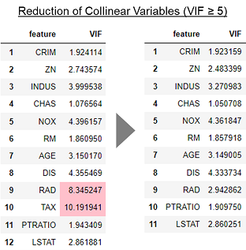
  
- Performed tests on residuals to verify assumptions of linear regression

  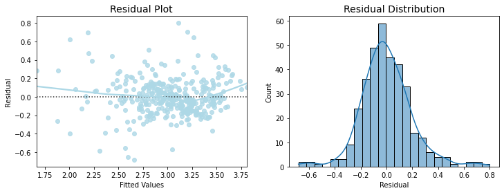

### Key Outcomes:
- This model achieved an R2 value of .729 when cross validation techniques were applied
- Against the test dataset, the model had a Mean Absolute Percentage Error (MAPE) of 5.26%, very close to the 4.98% MAPE against the training dataset
- A linear regression equation was created from the coefficients produced by the models

<!--                                *********************************** 5 - Clustering Cars ************************************************* -->
---

    
<h1>Car Clustering</h1>

    
<b><i>Employing Unsupervised Learning Techniques to Group Automobiles</i></b>

A clustering model was built to group and identify similarities among automobile models sold between 1970 and 1982.  The provided vehicle data included a variety of characteristics including gas mileage, engine cylinders, horsepower and other vehicle specifications. 

### Major Accomplishments:
- Dimensionality reduction techniques such as Principal Component Analysis (PCA) and t-Distributed Stochastic Neighbor Embedding (t-SNE) were employed to group vehicles with similar characteristics
- Clusters identified with t-SNE were examined against the original variables to uncover common traits and correlations  
  

### Key Outcomes:
- Clustering techniques identified that vehicles were largely grouped by engine cylinder count, displacement, horsepower, and vehicle weight which are all highly correlated 

  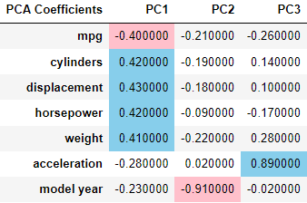 
 
- Analysis also highlighted the effects of the gas crisis as a degradation in characteristics associated with engine power coincided with an increase in gas mileage 

  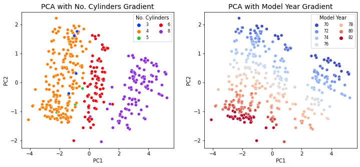 
  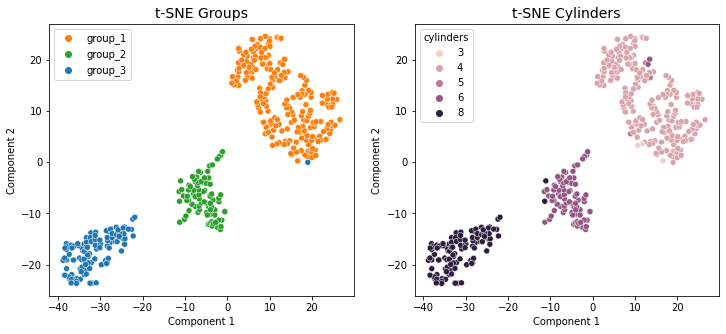

<!--                                      *********************************** Contact Info ************************************************* -->

<!--
---

    
<h1>Contact Information</h1>

- Email: <a href = "mailto: drossetti12@gmail.com" style="color: red">drossetti12@gmail.com</a>
- LinkedIn: [https://www.linkedin.com/in/daniel-r-10882139/](https://www.linkedin.com/in/daniel-r-10882139/)
- MIT ADSP Certificate:  [https://www.credential.net/0655323a-4a50-49d6-9dfc-a81e5e4b7ca8#gs.o5fack](https://www.credential.net/0655323a-4a50-49d6-9dfc-a81e5e4b7ca8#gs.o5fack)
- MIT ADSP ePortfolio: [https://eportfolio.greatlearning.in/daniel-rossetti](https://eportfolio.greatlearning.in/daniel-rossetti)
-->

---

    
<h3>Contact Information</h3>

    
 <a href = "mailto: drossetti12@gmail.com">drossetti12@gmail.com</a> | <a href = "https://www.linkedin.com/in/daniel-r-10882139/">LinkedIn</a> | <a href = "https://www.credential.net/0655323a-4a50-49d6-9dfc-a81e5e4b7ca8#gs.o5fack">MIT ADSP Certificate</a> | <a href = "https://eportfolio.greatlearning.in/daniel-rossetti">MIT ADSP ePortfolio</a>

---
