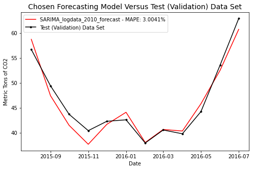
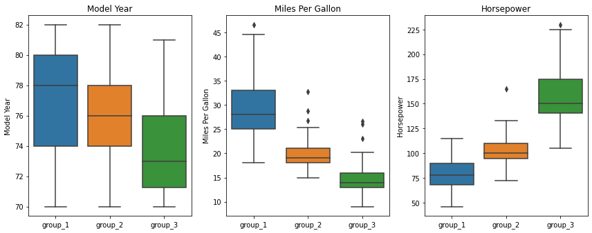

<!-- keep this here -->

# Project Portfolio Contents:
- Titanic Classification Model (Self Directed)
- Carbon Emissons Timeseries Forecasting (MIT ADSP Capstone Project)
- Unsupervised Learning (Clustering) Project (MIT ADSP)
- Boston Home Prices Linear Regression Project (MIT ADSP)
- Deep Learning (Artificial and Convolutional Neural Networks) Project (MIT ADSP)
- Recommendation System Project (MIT ADSP)
- ***Coming Soon!***
  - SQL Project
  - Self-Directed Clustering Project
<!--
h1{
    margin-top: 0px;
}
-->

<!--                                      *********************************** 1 - TITANITC ************************************************* -->

---

# Titanic Classification Model 
***Kaggle Competition:  "Titanic - Machine Learning from Disaster"*** <!-- - link to python code [here](https://github.com/drossDS/Project-Classification-Titanic_Machine_Learning) -->

<!--# [Classification Project (Kaggle):  "Titanic - Machine Learning from Disaster"](https://github.com/drossDS/Project-Classification-Titanic_Machine_Learning)-->
A classification model was developed to determine the outcome (survival or death) of passengers on the Titanic based on personal information such as the passenger gender, age, class, and other categorical and numerical variables.  Data sets were provided by Kaggle and included a training data set with passenger outcomes model fitting and a test data set on which to run the model and submit the results for the competition. 
### Major Accomplishments:
- Performed exploratory data analysis (EDA) on passenger data to find trends and inform feature engineering  
  

- Employed hypothesis testing validate the statistical significance of engineered features  

  
- Examined the performance of Logistic Regression, K-Neighbors, Decision Tree, and Random Forest Classifier models
- Used sklearn GridSearchCV to optimize models to increase model accuracy
- Generated training and validation sets using sklearn ShuffleSplit to simulate the effects of unseen data and reduce overfitting  

 

### Key Outcomes:
- A random forest classifier model was chosen with a predicted accuracy of about 82% based on validation data
- The chosen random forest model predicted the test data with a 77.3% accuracy
  - Next steps and model refinements are proposed in the code to improve this closer to the 82% prediction accuracy achieved on the validation data sets

<!--                                *********************************** 2 - CARBON EMISSIONS ************************************************* -->

---

# Carbon Emissons Timeseries Forecasting
***Capstone Project - MIT Applied Data Science Program***

A timeseries regression model was created to forecast future carbon emissions using timeseries data for electric energy production emissions from natural gas in the US from 1973 to 2016.

### Major Accomplishments:
- A model was created to forecast future emissions for a period of 1 year beyond the provided data
- Training Data Processing:
  - Different data transformation techniques were evaluated to optimize model performance
  - Various training data timespans over which the model would be fit were also examined to reduce prediction error
- Model Development:
  - Basic AR, MA, ARMA, and ARIMA models were optimized and evaluated
  - A Seasonal ARIMA (SARIMA) model was tuned using the Pmdarima auto_arima optimizer function
- Model performance was primarily characterized by calculating root mean squared error (RMSE) values for each combination of model, transformation technique, and fit data timespan 

### Key Outcomes:
- A 3% mean absolute percent error (MAPE) for the final model was calculated against the validation data set 

   
- Carbon emissions levels were forecasted for the 12 months following the provided data 

  

---
<!--                                *********************************** 3 - Clustering Cars ************************************************* -->

# Automobile Clustering - Unsupervised Learning
***Weekly Project - MIT Applied Data Science Program***

A clustering model was built to group and identify similarities among automobile models sold between 1970 and 1982.  The provided vehicle data included a variety of characteristics including gas mileage, engine cylinders, horsepower and other vehicle specifications. 

### Major Accomplishments:
- Dimensionality reduction techniques such as Principal Component Analysis (PCA) and t-Distributed Stochastic Neighbor Embedding (t-SNE) were employed to group vehicles with similar characteristics
- Clusters identified with t-SNE were examined against the original variables to uncover common traits and correlations  
  

### Key Outcomes:
- Clustering techniques identified that vehicles were largely grouped by engine cylinder count, displacement, horsepower, and vehicle weight which are all highly correlated 

   
 
- Analysis also highlighted the effects of the gas crisis as a decrease characteristics associated with engine power coincided with an increase in gas mileage 

   
  

---
<!--                                *********************************** 4 - Boston Houses - Linear Regression ************************************************* -->

# Boston Home Prices - Linear Regression Project
***Weekly Project - MIT Applied Data Science Program***

A linear regression model was created to predict median home values in Boston-area suburbs and towns based on a variety of factors including the geographic and socioeconomic characteristics of the home locations.  Housing data were provided and analysis was performed to determine the most important factors affecting values.  An equation was developed from the coefficients produced by the model capable of estimating home prices.
 
### Major Accomplishments:
- Performed exploratory data analysis of the provided data
- Examined variable correlations and removed multicollinearity using Variance Inflation Factor (VIF) criteria

  
- Performed tests on residuals to verify assumptions of linear regression

  

### Key Outcomes:
- This model achieved an R^2 value of .729 when cross validation techniques were applied
- Against the test dataset, the model had a Mean Absolute Percentage Error (MAPE) or 5.26, very close to the 4.98% MAPE against the training dataset
- A linear regression equation was created from the coefficients produced by the models

